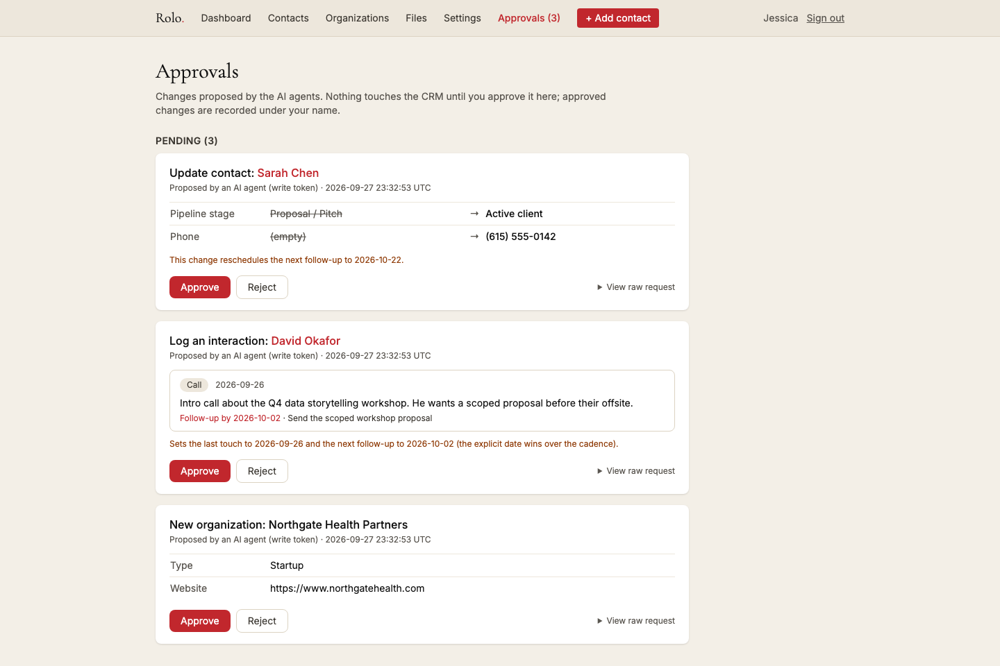

# Rolo

[](https://github.com/tuckercr/rolo-showcase/actions/workflows/ci.yml)

A CRM I built for a two-person consultancy that was drowning in a Coda
spreadsheet. The whole idea fits in one sentence: capture a contact in under
30 seconds, log every interaction, never lose track of who to talk to next.

The stack is deliberately boring. PHP 8.4, MariaDB, server-rendered HTML. No
build pipeline, no SPA. Deploying is copying files to shared hosting. There's
one deliberately modern piece: the CRM is also an **MCP server** (Model
Context Protocol), so AI assistants like Claude and Superhuman plug straight
into it. Every change they propose waits for human approval. No exceptions.

> **Note:** this is a public snapshot of a private production repo. Internal
> docs, deploy scripts, and history are stripped, and the seed data is
> genericized. The real thing runs in production every day.

## Screenshots

**Approvals.** AI agents propose changes over MCP. A human sees a live
before/after diff and exactly what the change does to the follow-up schedule,
then approves or rejects. Agents never touch the CRM directly.



**Dashboard.** The Monday review: overdue and due this week, each contact
with a note saying what actually needs doing.


**Contact detail.** Full history, cadence snooze, and a one-line "human
detail" so you remember the person, not just the pipeline stage.


**Contacts.** Sortable, searchable, overdue flagged in red.


**Organizations.** Grouped view with per-org contact counts.


## The MCP integration

This is the part worth reading the code for. The CRM doubles as a tool server
for AI agents, with one rule enforced in the API layer instead of in agent
instructions: **reads are live, writes never land directly.**

- **REST API** (`/api/v1/*`). Separate read-only and read-write bearer tokens
  compared in constant time, cursor pagination, machine-readable errors, a
  120 req/min rate limit per token, and an audit row for every request.
- **MCP endpoint** (`/mcp`). The same tools over streamable HTTP: 13 tools
  with JSON schemas, read tools marked `readOnlyHint`, and a protocol core
  that's a pure, unit-tested class. Clients that can't send an Authorization
  header (claude.ai custom connectors) pass the token as a URL secret, which
  the audit trail redacts.
- **Every agent write is a proposal.** Bad payloads bounce immediately with a
  plain-English reason. Retries dedupe on idempotency keys. The review page
  shows each change as a live before/after diff against current data, plus a
  consequence line ("reschedules the next follow-up to Oct 23") computed by
  the same rules engine that will apply it. Approvals are attributed to the
  human; the proposing token stays on the audit trail.
- **Agents can't wreck the schedule.** Agent-logged activities don't count as
  a personal touch unless explicitly flagged, so bulk campaign logging can't
  clear the follow-up queue. A backdated touch approved out of order goes
  into history without dragging the schedule backwards.

## What it does

- **Contacts and organizations.** Only a name is required to capture. A
  configurable pipeline (New/Captured through Active client), search,
  sortable columns, and a "human detail" field for the one memorable thing
  about each person.
- **A follow-up rules engine.** Every logged interaction or stage change
  schedules the next touch from per-stage cadence rules stored in the
  database: fixed days, cadence from last touch, or business days. Rules are
  editable in a settings UI with one-click reset. An explicit "follow up by
  Saturday" always beats the cadence, and per-contact overrides beat the
  stage default.
- **A dashboard that matches how the user actually works.** Overdue plus due
  this week, the real Monday review. Overdue is always derived
  (`next_touch_date < today`), never stored, so it can't drift.
- **A daily summary email.** Every morning at 9 AM Eastern: overdue, due
  today, what was logged yesterday, topped with a "have you logged what you
  did yesterday?" nudge. A GitHub Actions schedule hits a token-guarded
  endpoint; the app enforces local send time and once-per-day semantics, so
  DST is handled and retries are safe.
- **An interaction history built for real use.** Edit in place with "edited
  by" attribution, editable dates, delete, file attachments (allowlisted by
  extension AND sniffed content type, stored outside the web root under
  random names, download-only), snooze that leaves an audit entry, and
  trash-can soft deletion with restore.
- **Follow-up notes.** Check "Follow-up needed" and a "What needs doing?"
  field appears. The note follows the contact onto the dashboard and into the
  daily email until the follow-up is logged, then clears itself.
- **Tags.** Freeform, comma-separated, case-insensitively deduped, filterable
  everywhere, auto-pruned when orphaned.
- **Two-person collaboration.** `created_by` / `updated_by` trails are stored
  and shown ("added by Jessica, last updated by Colin"), so both users always
  know who touched what.

## Architecture

Hand-rolled MVC, one front controller. Small enough to read in an afternoon:

```
public/index.php     front controller: session, auth gate, FastRoute dispatch
config/              bootstrap (.env via phpdotenv, UTC discipline), route table
src/Controllers/     request handling, no SQL, no HTML; Api/ holds the
                     stateless bearer-token REST + MCP controllers
src/Models/          PDO data access, one class per entity
src/Services/        ReminderService (the rules engine), ProposalService
                     (validate/queue/apply agent writes), McpProtocol,
                     GoogleAuthService, DailySummaryService, AttachmentService
src/Views/           PHP templates only; escaping helper on all dynamic output
src/Support/         Config, Database, Session, Csrf, Auth, Mailer, Migrator
database/migrations/ ordered .sql files, forward-only, tracked in a table
tests/               PHPUnit, focused on the logic most likely to break
```

Engineering choices I'd defend:

- **Auth is Google Sign-In only**, with an email allowlist. Google proves
  identity, the allowlist decides authorization. No passwords exist anywhere
  in the system. ID-token claims (`iss`, `aud`, `exp`, `email_verified`) are
  validated in pure, unit-tested functions.
- **The cadence engine is data, not code.** Changing "follow up with
  proposals after 5 business days" is a settings-page edit, not a deploy. The
  engine itself is a pure class with rules injected as arrays, and the
  weekend math and precedence order are fully unit-tested.
- **UTC discipline.** Storage and `CURRENT_TIMESTAMP` are UTC (the PDO
  session forces `time_zone = '+00:00'`). "Today" for humans is always
  computed in the business's timezone, so an evening entry never lands on
  tomorrow's date.
- **Security basics done properly.** Prepared statements everywhere, zero SQL
  concatenation, CSRF tokens on every state-changing form, escaping on all
  dynamic output, httponly/secure/SameSite cookies, session ID regeneration
  at login, strict types in every file.
- **Soft deletes over hard deletes.** Trashing a contact hides it from every
  list, search, and reminder, but the full history stays restorable. There is
  deliberately no hard delete in the UI.
- **No-build deploys.** In the production repo `vendor/` is committed by
  design; deployment to shared hosting is a file mirror. A token-gated HTTP
  migration endpoint applies pending migrations on hosts where the database
  isn't reachable from outside.

## Stack

| Layer     | Choice                                              |
|-----------|-----------------------------------------------------|
| Backend   | PHP 8.4 (strict types), FastRoute, phpdotenv, PHPMailer |
| Database  | MariaDB 10.11 via PDO (native prepares)             |
| Frontend  | Server-rendered PHP views, Tailwind CSS via CDN     |
| Email     | SMTP (STARTTLS) or `mail()` fallback                |
| CI        | GitHub Actions: `php -l`, PHP_CodeSniffer (PSR-12), PHPUnit |
| Scheduler | GitHub Actions cron hitting a token-guarded endpoint |

## Running locally

```bash
git clone <repo> && cd rolo
composer install
cp .env.example .env                   # point DB_* at a local MariaDB
php bin/migrate.php                    # creates schema + seeds stages/cadence rules
php -S 127.0.0.1:8000 -t public public/index.php
```

With `APP_ENV=local` the login page offers one-click dev sign-in, no Google
credentials needed. Tests and linting:

```bash
vendor/bin/phpunit
vendor/bin/phpcs
```

## License

Apache-2.0. See [LICENSE](LICENSE).
