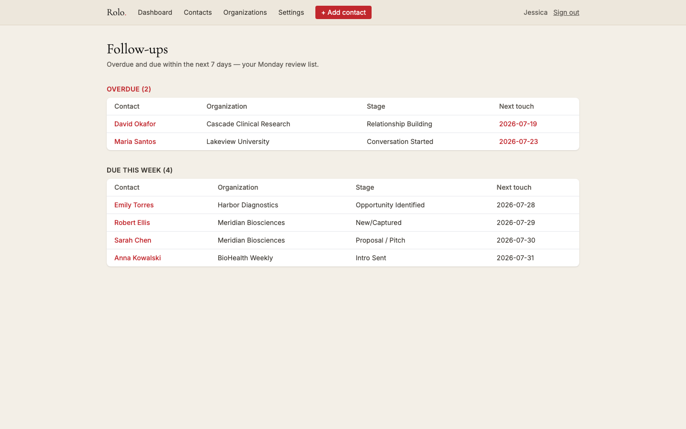
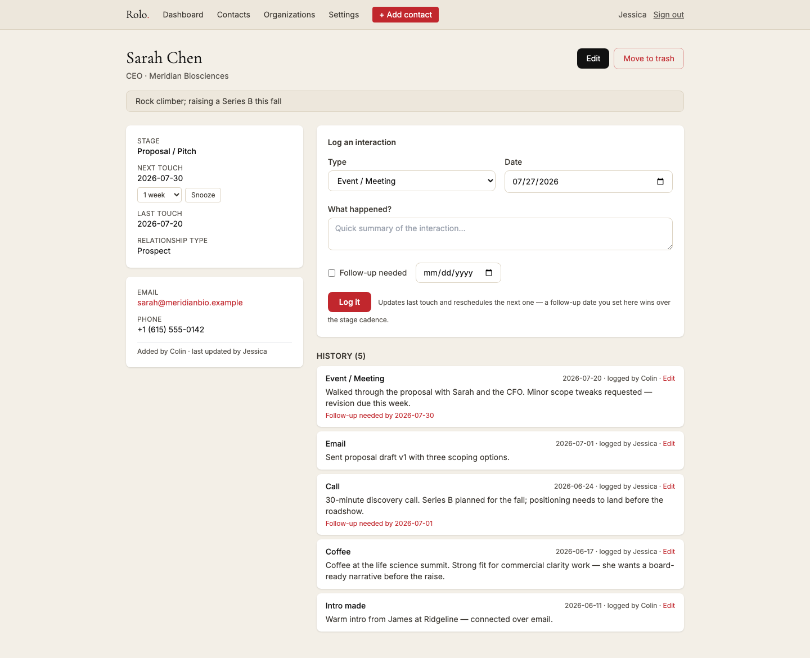
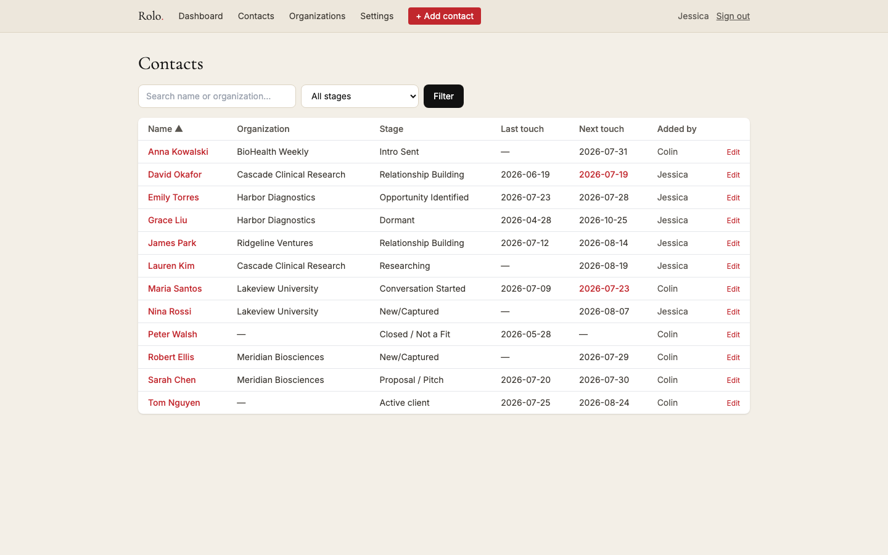
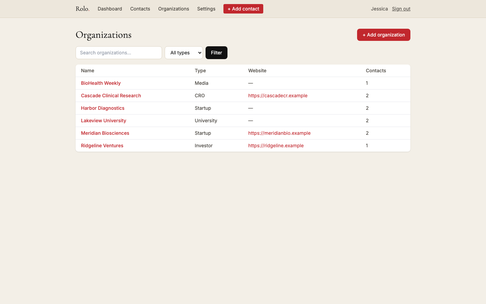

# Rolo

A relationship-first CRM built for a fractional CMO consultancy — replacing a
Coda spreadsheet-CRM with a fast, opinionated web app whose core loop is:
*capture a contact in under 30 seconds, log every interaction, and never lose
track of who to talk to next.*

Built with deliberately boring technology: PHP 8.4, MariaDB, and server-rendered
HTML — no build pipeline, no SPA, deployable to shared hosting by copying files.

> **Note:** this is a public snapshot of a private production repository.
> Internal docs, deploy scripts, and history are excluded, and the seed data
> and examples are genericized. The app itself runs in production for a real
> two-person consultancy.

## Screenshots

**Dashboard** — the Monday review: overdue and due-this-week follow-ups.



**Contact detail** — engagement history, cadence snooze, and the one-line
"human detail" that keeps relationships personal.



**Contacts** — sortable, searchable, with overdue dates flagged.



**Organizations** — grouped view with per-org contact counts.



## What it does

- **Contacts & organizations** — quick capture (only a name required), a
  configurable relationship pipeline (New/Captured → … → Active client), search,
  sortable columns, and a "human detail" field for the one memorable thing about
  each person.
- **Follow-up rules engine** — every logged interaction or stage change
  schedules the contact's *next touch* from per-stage cadence rules stored in
  the database (fixed days, cadence-from-last-touch, or business days). Rules
  are editable in a settings UI with one-click reset to defaults. An explicit
  "follow up by *date*" always beats the cadence, and per-contact overrides
  beat the stage default.
- **Dashboard** — overdue + due-this-week, mirroring the user's real Monday
  review routine. Overdue is always derived (`next_touch_date < today`), never
  stored, so it can't drift.
- **Daily summary email** — every morning at 9 AM Eastern: overdue, due today,
  and what was logged yesterday, topped with a "Have you logged what you did
  yesterday?" nudge. Triggered by a GitHub Actions schedule hitting a
  token-guarded endpoint; the app enforces local send time and once-per-day
  semantics, so DST is handled and retries are safe.
- **Interaction history** — append-friendly activity log with edit-in-place
  (latest content only, `edited by …` attribution), snooze (1 day / 1 week /
  1 month) that leaves an audit entry, and trash-can soft deletion with restore.
- **Two-person collaboration** — `created_by` / `updated_by` trails are stored
  *and shown* ("added by Jessica · last updated by Colin"), so both users can
  always see who touched what.

## Architecture

Hand-rolled MVC with a single front controller — small enough to read in an
afternoon:

```
public/index.php     front controller: session, auth gate, FastRoute dispatch
config/              bootstrap (.env via phpdotenv, UTC discipline), route table
src/Controllers/     request handling — no SQL, no HTML
src/Models/          PDO data access, one class per entity
src/Services/        ReminderService (the rules engine), GoogleAuthService,
                     DailySummaryService — pure logic, unit tested
src/Views/           PHP templates only; escaping helper on all dynamic output
src/Support/         Config, Database, Session, Csrf, Auth, Mailer, Migrator
database/migrations/ ordered .sql files, forward-only, tracked in a table
tests/               PHPUnit, focused on the logic most likely to break
```

Engineering choices worth noting:

- **Auth is Google Sign-In only** (OAuth 2.0 authorization-code flow) with an
  email allowlist: Google proves identity, the allowlist decides authorization.
  No passwords exist anywhere in the system. ID-token claims (`iss`, `aud`,
  `exp`, `email_verified`) are validated in pure, unit-tested functions.
- **The cadence engine is data, not code.** Changing "follow up with proposals
  after 5 business days" is a settings-page edit, not a deploy. The engine
  itself is a pure class — rules injected as arrays — with the weekend math and
  precedence order fully unit-tested.
- **UTC discipline**: storage and `CURRENT_TIMESTAMP` are UTC (the PDO session
  forces `time_zone = '+00:00'`); "today" for humans is always computed in the
  business's timezone, so an evening entry never lands on tomorrow's date.
- **Security basics done properly**: prepared statements everywhere (zero SQL
  concatenation), CSRF tokens on every state-changing form, `htmlspecialchars`
  on all dynamic output, httponly/secure/SameSite session cookies, session ID
  regeneration at login, and strict types in every file.
- **Soft deletes over hard deletes**: trashing a contact hides it from every
  list, search, and reminder — but keeps the full history restorable. There is
  deliberately no hard-delete in the UI.
- **No-build deploys**: in the production repo `vendor/` is committed by design; deployment to shared
  hosting is a file mirror. A token-gated HTTP migration endpoint applies
  pending migrations on hosts where the database isn't reachable from outside.

## Stack

| Layer     | Choice                                              |
|-----------|-----------------------------------------------------|
| Backend   | PHP 8.4 (strict types), FastRoute, phpdotenv, PHPMailer |
| Database  | MariaDB 10.11 via PDO (native prepares)             |
| Frontend  | Server-rendered PHP views, Tailwind CSS via CDN     |
| Email     | SMTP (STARTTLS) or `mail()` fallback                |
| CI        | GitHub Actions: `php -l`, PHP_CodeSniffer (PSR-12), PHPUnit |
| Scheduler | GitHub Actions cron → token-guarded endpoint        |

## Running locally

```bash
git clone <repo> && cd rolo
composer install
cp .env.example .env                   # point DB_* at a local MariaDB
php bin/migrate.php                    # creates schema + seeds stages/cadence rules
php -S 127.0.0.1:8000 -t public public/index.php
```

With `APP_ENV=local` the login page offers one-click dev sign-in (no Google
credentials needed). Tests and linting:

```bash
vendor/bin/phpunit
vendor/bin/phpcs
```

## License

Apache-2.0 — see [LICENSE](LICENSE).
